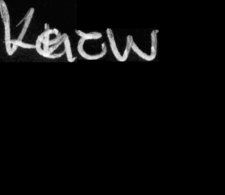
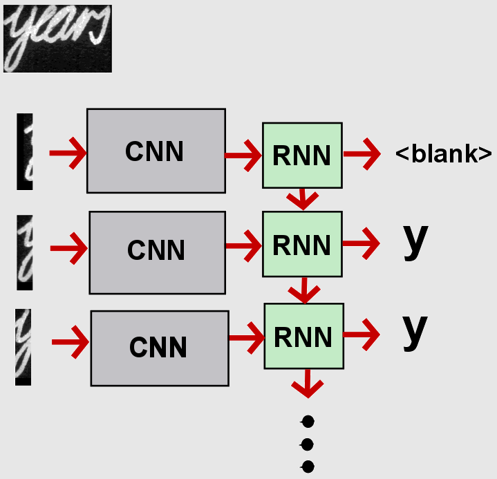
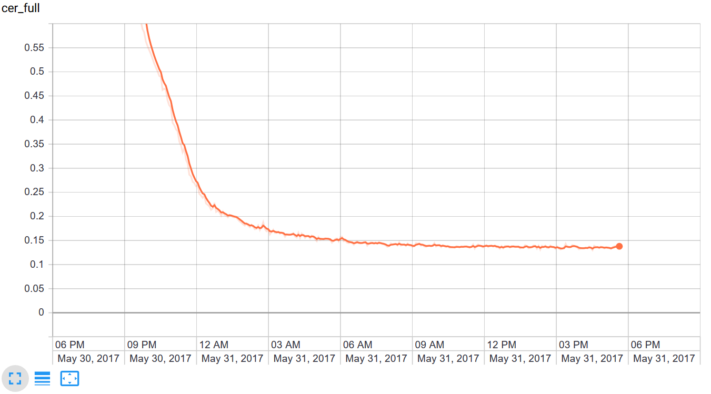

# OCR
Optical Character Recognition with Tensorflow

This is a Tensorflow implementation of an Optical Character Recognition architecture I implemented during my master’s thesis. It was applied and tested on the IAM dataset.  
http://www.fki.inf.unibe.ch/databases/iam-handwriting-database  

##  Explanation
The architecture consists of an encoder module in form of a CNN and a GRU based RNN module which contains an attention mechanism, to attend to different parts of the input selectively. To reduce the memory requirements and to handle various wide images a sliding window-based approach was taken. The height of each image is padded to the height of the highest image in the dataset. The image is encoded by a CNN and then cut into several pieces. How they are cut is determined by the width and the offset of each window. Overlapping is allowed and is computed similar to the computation of the size of a convolution result. An example word and the first four windows can be seen in the following figures:  
  

  
Each image window is then inserted into the RNN module which can attend to specific spots in the image. The RNN outputs a character at each time step and a Connectionist Temporal Classification loss is used. During application a greedy algorithm is applied where are repeated characters merged if there is not a separation symbol between them. An image of the architecture can be found in the following figure:  

  
More information can be found in the master’s thesis at docs/Thesis_Kappen.pdf  
##  Dependencies
The code requires the following libraries in order to work:    
* Tensorflow 1.0.0. It does not work with Tensorflow versions starting from 2.0 without changes.  
* Numpy  
* Scipy  
* Random  
* Math  
* OS  

##  Installation
In order to use the project, adding all dependcies to a Python interpreter is necessary. After downloading the src directory it can be executed, with the python interpreter, by executing the main.py file.  
##Example
The software has to be installed as stated in installation. In order to use the example, the IAM dataset must be downloaded and the ConvertToFile function in the src/utility.py file must be executed on the respective files of the IAM dataset. It will create a train set data file, a validation set data file, a test set data file for training and a meta data file for meta information. This step was necessary to improve the training speed. The file contained in the src directory encoder_decoder_model_1_translator.txt. must also be downloaded. It translates characters to numbers and adds additional characters. In the main file all LOCATION_... constant variables must be set to the respective file locations. It can then be executed. It will store a checkpoint every 2000 steps and create a Tensorboard summary every 10 steps in a subdirectory of the directory containing the main.py file. Results of a run can be found in the following figure:  
  
The tensorboard file can be found in the Attention_Model_Trace directory.

